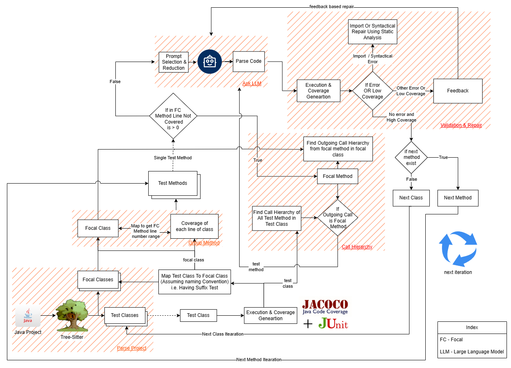

# AutoTestGen: A LLM-based java unit test generation and improving tool

## Introduction

...

## Installtion
...

## Run
...

## MISC
Our work will be published in paper soon...
```
@misc{

}
```


## Contact us
If you have any questions or would like to inquire about our experimental results, please feel free to contact us via email. The email addresses of the authors are as follows:

1. Chirag Padyal (chirag.padyal@gmail.com)
2. Anuj Kundar
3. VIshal Bangar
4. Siddhant Darekar

## License
The project is licensed under the [MIT License](./LICENSE).